# Exploration of Prosper Loan Dataset
_updated 08 May 2016_

This project explores the Prosper loan dataset, which contains data on 113,937 loans across 81 variables, ranging from interest rate, to loan amount, to borrower's income and employment status, and so on. My exploration focuses in particular on the interest rate applied to the loan. The variable dictionary can be found [here] ('https://github.com/jasonstan/sandbox/blob/master/prosper_loan_exploration/prosper_data_dictionary.csv').

### Visual exploration of dataset


Let's begin by taking a tour of some of the important fields in this dataset, starting with time -- what does the distirbution of loans given over time look like?

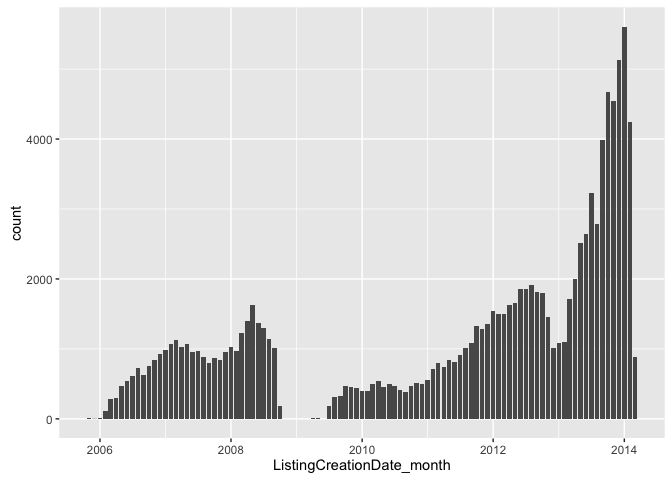

Lending activity experienced booms and busts over time, with one period in late 2008 to early 2009 seeing a virtual halt to lending, and another period from 2013 onwards seeing many more loans given than in other periods. The 2008-09 halt in lending is not surprising given that these years saw one of the worst financial crises of the last century. It isn't obvious on first sight what drove the major uptick in lending from 2013 onwards.

Now, let's examine how frequently different occupational groups show up in the loan data.

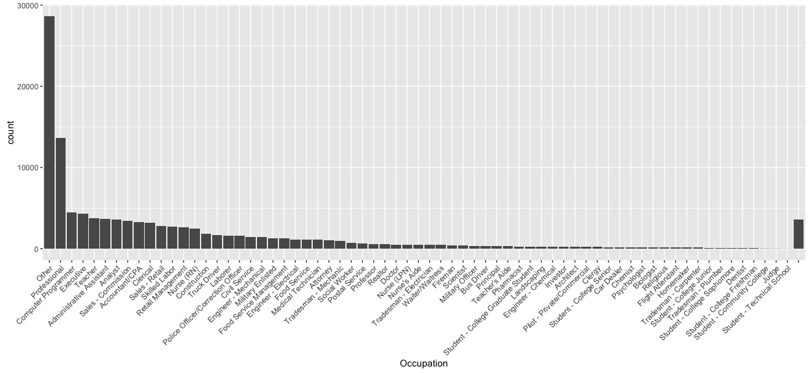

```
## Percentage rows with 'Other': 25.1
```

```
## Percentage rows with no occupation data listed: 3.1
```

Unfortunately, 25.1% of rows list 'other' in the occupational field, while a further 3.1% of rows have no occupation data listed at all. This makes it hard to interpret the significance of the data in other columns.

Leaving aside these problems, we see that professional and higher-income occupations show up frequently, while low-income and likely unemployed groups like students and homemakers show up infrequently in the data set. This is not surprising given that low-income and unemployed groups are likely seen as much greater credit risks for lending institutions, so likely get turned down for loans more frequently and likely self-select out of the pool of borrowers by not seeking loans in the first place given the higher likelihood of being turned down.

Let's look at borrowers' delinquiencies over the seven years preceding loan approval.

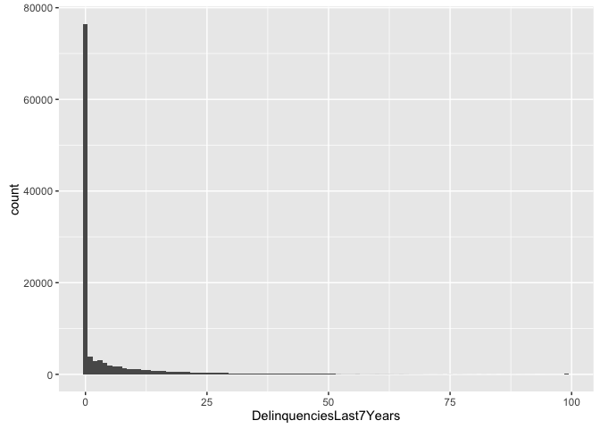

The vast majority of borrowers have zero or near-zero delinquencies. This is unsurprising given that past delinqency suggests credit unworthiness, which makes it less likely that an applicant will be approved for a loan, and therefore less likely that they will show up in this data set of borrowers in the first place.

Let's look at it as a histogram with the X-axis on a log10 scale in order to better see the long tail.

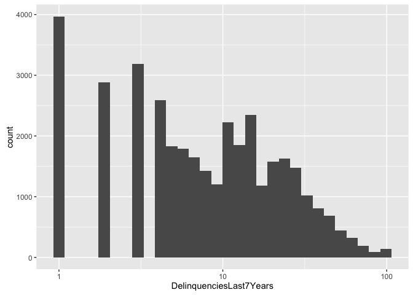

And again with a normal X-axis scale but limited to an upper bound of 4,000 on that axis, so that we can better see the long tail.

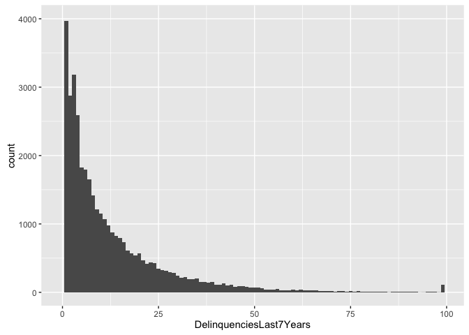

Together, in these two plots, we can see the long tail much clearer, though now interpretation becomes a bit more challenging because each bin actually corresponds to a different range of delinquincies, with bin size growing larger as we move to the right. 

What we can see here is that, while most borrowers have zero or near-zero delinquencies in the last seven years, there is a not inconsiderable number of borrowers that have some dlinquencies, including some that have upwards of 100 delinquencies. This seems almost impossible to believe, so there might be a problem with the way the day was encoded.

Can we learn more about delinquencies by looking at the distribution of current days delinquent?

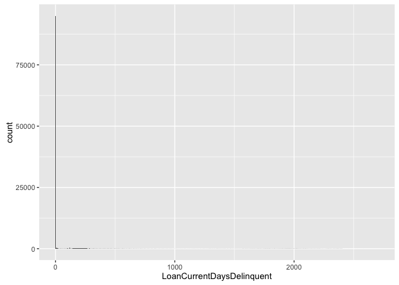

Okay, the vast majority of borrowers appear to not be delinquent at all. But this view is unhelpful in understanding the long tail that appears to exist. Let's exclude rows where current days delinquent is equal to zero.

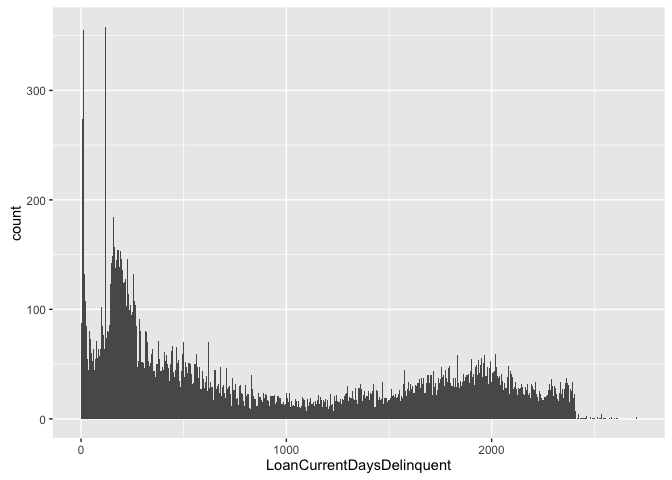

That's better. Here we see an interesting pattern, with three peaks. The first peak occurs near zero, which is not surprising. We should expect to see many borrowers just a few days delinquent. But then things get interesting. There's a peak at about 200 days, and then a smaller peak at about 2000 days. There is likely a relationship between this pattern and the pattern we saw above in the chronological distribution of loans. In that distirbution, we saw several peaks, and a period of no lending at all. If the rate of loans eventually turning delinquent is constant over time, we would expect to see peaks and valleys in delinquent loans given that there are peaks and valleys in the overall number of loans given over time.

Let's zero-in on the delinquencies between 0 and 500 days to get a better look at the distribution.

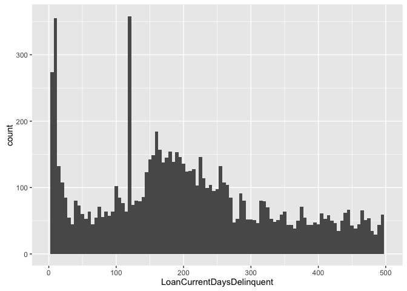

We can see that the modal group (leaving aside zero delinquent days) is at approximately 120 days, and that this is significantly higher than surrounding bins. Were this to become a more in-depth research project I would want to investigate what drove that peak.

Let's look at the distribution of current days delinquent on a log10 X-axis.

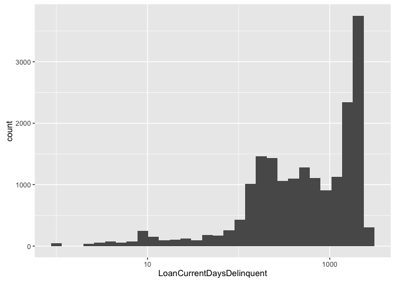

This view reinforces the finding that the long tail is actually quite large and important.

Let's look at the distribution of loans by the size of the loan.

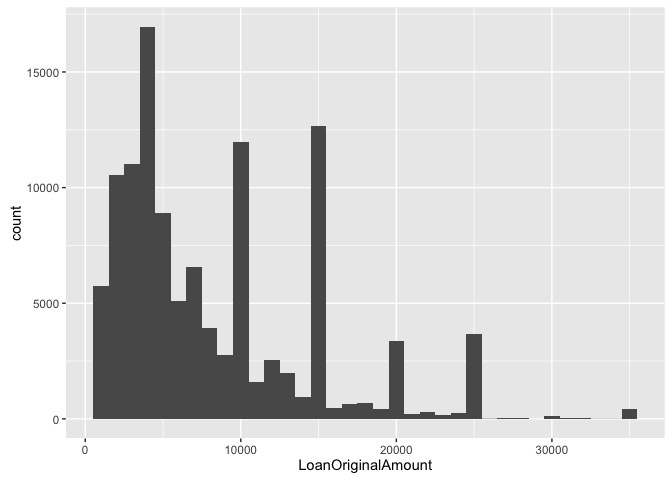

This distribution is positively skewed, but with big peaks at the $5,000 marks, which suggests that lending institutions like to work with these rounded numbers. The modal amount is $5,000, with $15,000 and $10,000 not far behind. Few loans over $15,000 were given out.

What does the distribution of borrower rates look like?

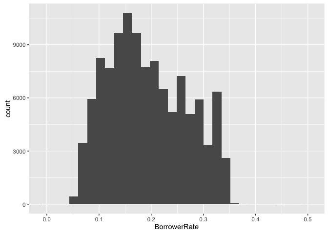

This distribution is close to normal, with a very slight positive skew. One of the goals of this exploration is to understand better what drives variation in borrower rate, so we'll be looking at this variable much more below.

Now, let's turn to the distribution of borrower's stated monthly income.


```r
# get summary of variable
summary(loans$StatedMonthlyIncome)
```

```
##    Min. 1st Qu.  Median    Mean 3rd Qu.    Max. 
##       0    3200    4667    5608    6825 1750000
```

Looking at the summary stats for this variable, we can see that there is an extremely long tail. Let's see what it looks like with the income variable transformed on a log10 scale.

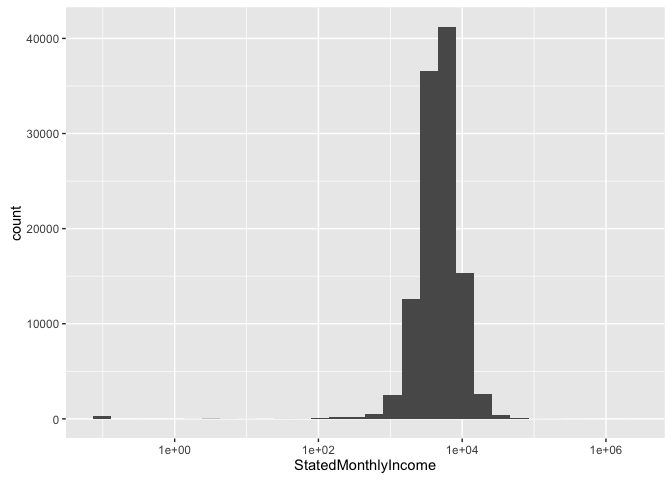

This gets us to a very tight quasi-normal distribution with a small number of outliers, but the axis isn't very interpretable. Let's try using a normal X-axis scale and limiting the axis range to capture most of the variation.

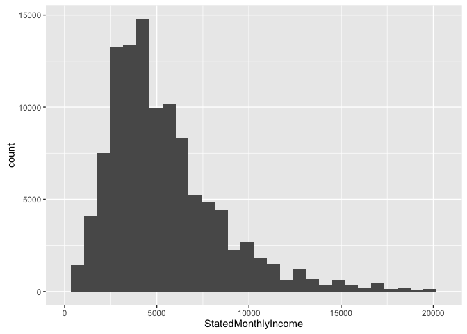

This is more helpful. Here we can see that the distribution is fairly normally distributed around a mean of just over $3,000. Previous plots suggest that some borrowers have monthly incomes that are astronomically higher. This could be either a data quality problem, or some extreme legitimate outliers.

Let's look at borrowers' debt-to-income ratio.

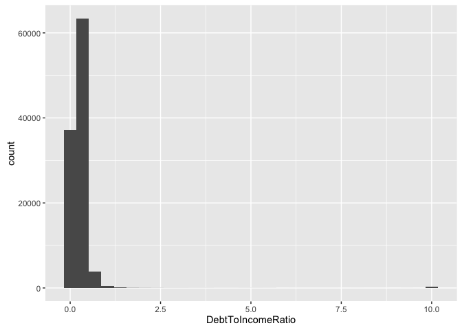

Again the distribution is hard to see. Let's transform to a log10 scale on the X-axis.


And now let's look at it with normal scale on the X-axis but with that axis bounded so that the plot excludes outliers.

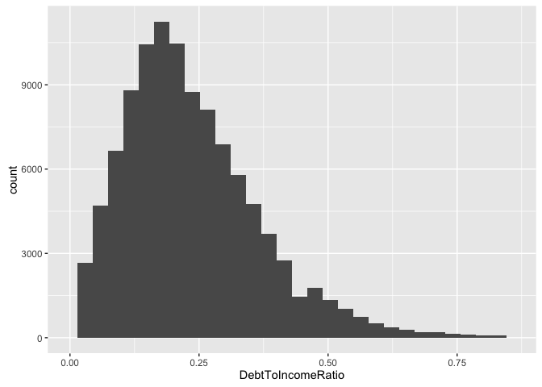

The distribution looks almost normal, with a slight positive skew. Nothing very exciting here.

Let's look at the distribution of employment status.

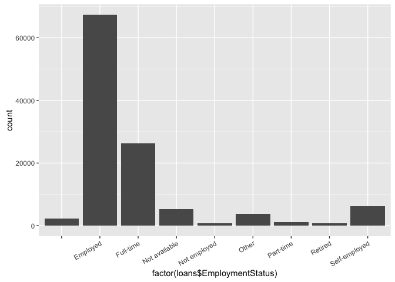

This doesn't look very helpful. The categories are not mutally exclusive and are at different levels of abstraction, making comparison non-sensical in many cases. For example, a borrower can apparently be 'employed' or 'full-time', but not both, which is not logical.

Now let's turn to the distribution of  borrowers' Prosper Score, which is the lending institution's score of credit-worthiness applied to all borrowers from July 2009 onwards.

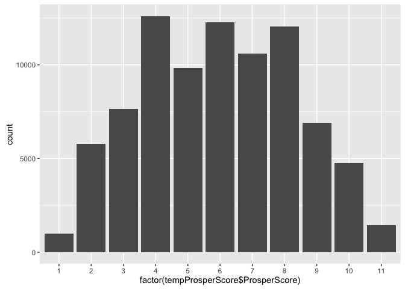

This is close to being normally distributed, though with a tri-modal appearance.

Let's begin by looking at the relationship between loan amount and borrower rate, two of the major features of interest that I chose to focus on in this analysis.

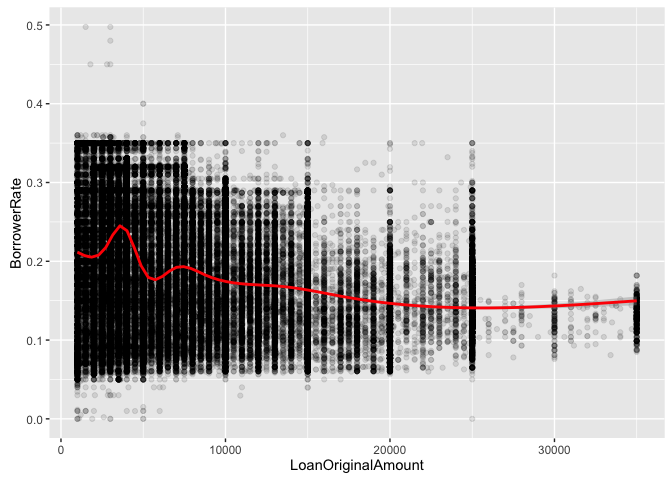

In general, larger loans tend to have lower interest rates, which is not surprising. The distribution of points is heteroscedastic, with much greater variation in borrower rate at low loan amounts than at high loan amounts. This will be worth exploring further below to see which other feature can help explain the differece in variability here.

How does loan amount vary by loan status?

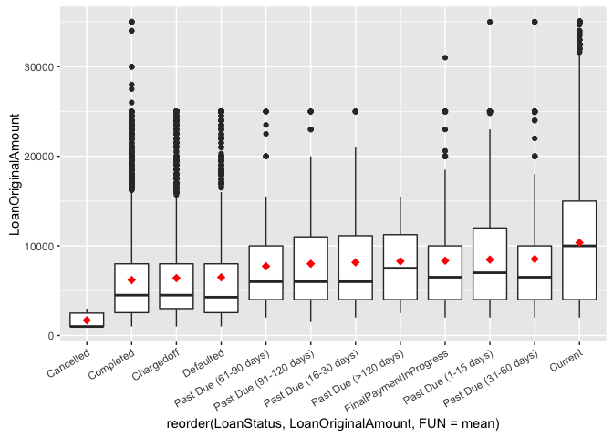

Interestingly, delinquent and defaulted loans have a lower mean and median loan amount, and fewer extreme positive loan amount observations than current loans. This could be a reflection of the lending institution not granting larger loans to those most likely to become delinquent. It might also be driven by inflation - if more recent loans are more likely to be current and also larger in size due to inflation, we would expect current loans to have higher average loan amount. Worth exploring more below.

To dig a little further, let's look at the distribution of loan amount over time.


Here we see clearly the virtual halt to all lending that occurred in late 2008 and early 2009, in the wake of the global financial crisis. We also see that, in period following the crisis, though lending re-commenced, loans tended to be smaller than at virutally any other time covered by the data set. Over time, as economic conditions improved, and as both borrowers and lenders became more confident in their economic prospects, average loan amount increased at a steady pace. This plot also shows that the lending insitution stopped granting loans below approximately $2,500 in 2011, and began offering loans up to a new ceiling (approximately $35,000) in early 2013.

Let's examine the relationship between loan amount and monthly income.

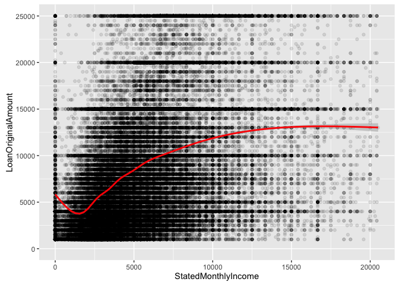

The general relationship here is not surprising - average loan amount grows as income rises, though only up to a point (approximately $12,000), at which point it plateaus. This likely reflects the fact that the lending institution sees higher income individuals as more capable of paying back larger loans, so is more willing to grant larger loans to these people.

The plot shows many cases of $0 monthly income. It's possible that these individuals are unemployed and therefore not earning any income and/or that some of these individuals are of high net worth and therefore not dependent on income, but it seems plausible that there might also be a data collection problem here, especially in cases where the borrower was granted a large loan. The average loan amount for $0 monthly income is higher than that for monthly incomes up to approximately $3,500. Would be worth exploring this in more detail below to see what explains this odd variation at the low end of the income spectrum.

When we look at employment status duration for each of the important types employment statuses, do we gain insight into the variation in loan amount?

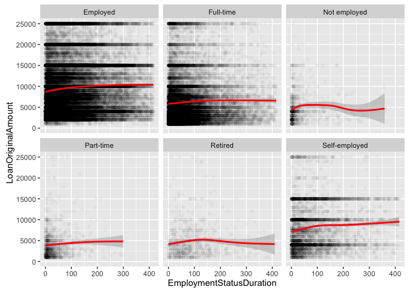

Loan amount begins higher and increases gradually for employed, full-time, and self-employed. Those in more precarious or lower income contexts (not employed, part-time employed, and retired) begin much lower and don't see the same kind of increase. Can also see that there are many fewer loans given to people with these more precarious loan statuses, and that loans given to these applicants almost always go to people who have been in this status for a short amount of time.

Does occupation drive loan amount?

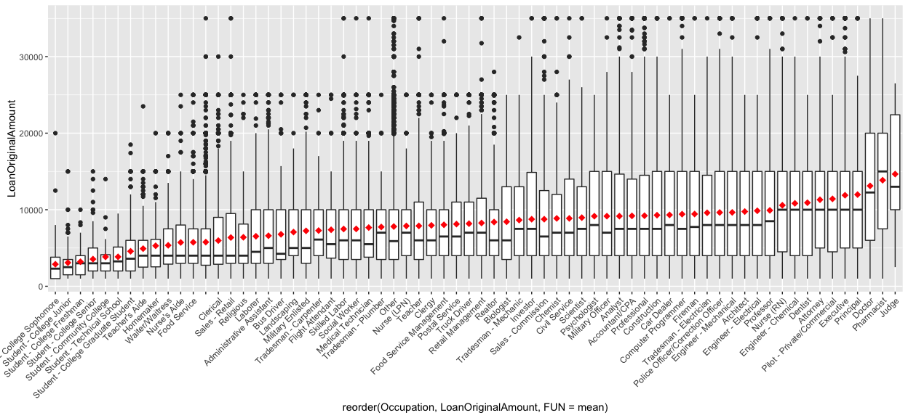

On average, small loans tend to go to students and large loans tend to go to judges, doctors, and others occupational groups that usually have high incomes and high social status. This trend is unsurprising.

Let's look at Prosper Score to see how, if at all, it explains variation in loan amount.

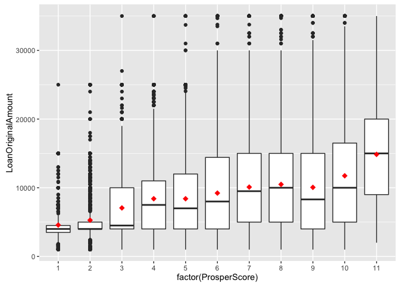

The relationship appears to be quite strong here. Borrowers with very low Prosper Scores tend to get small loans, and the variation in loan amount is very small. By contrast, borrowers with high Scores get much higher average loan amounts.

What does the relationship between borrower rate and loan status look like?

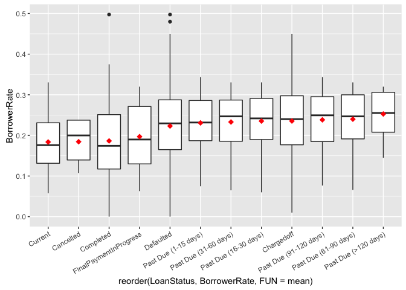

Current and completed loans have lower average borrower rate than defaulted or delinquent loans. This might be driven by the fact that borrowers that the bank feels are more creditworthy are given lower interest rates and then these borrowers do actually turn out to be more creditworthy, staying current on their loans. This seems plausible. It will be interesting to overlay Prosper Score on this plot, as this is our best read on how creditworthy the lending institution felt the borrower when the loan was granted.

To get a better sense of variation in borrower rate, let's look at how it has evolved over time.

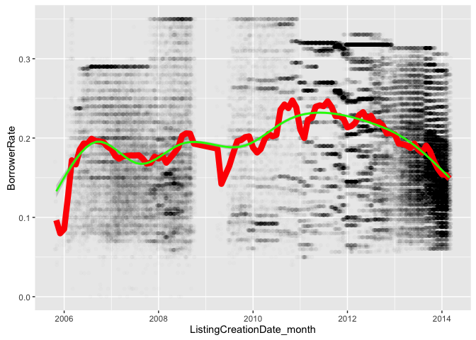

Here we see two important findings. First, a fairly dramatic dip in the average borrower rate from approximately late 2011 through to the end of the period covered by the data set. Second, we see what we have already seen in a separate plot above -- that the absolute number of loans given increased significantly in the last year or so of the dataset.

To continue our exploration of borrower rate, let's examine it's relatinoship with borrower income.

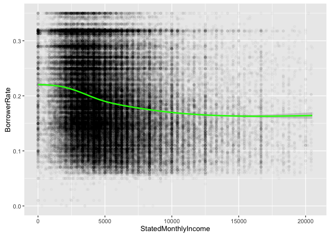

What we see here is that borrowers with higher monthly income tend to have lower borrower rates, though the relationship plateaus after approximately $10,000/month. This general relationship is not surprising.

On a related point, we need to look at the importance of debt-to-income ratio in explaining variation in borrower rate, as a borrower's existing debt load likely impacts the lending institution's confidence in their capacity to take on and pay back new debt.

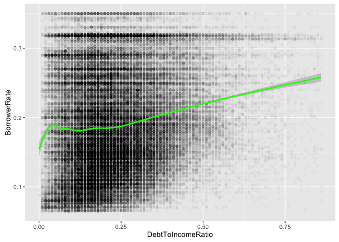

The general relationship is positive -- as debt-to-income ratio rises, so does borrower rate. A debt-to-income ratio of zero or near zero seems to result in a particulalry low borrower rate, though there are also few borrowers in this situation. Overall, there is pretty dramatic variation here, so this variable only explains a small portion of variance in borrower rate.

Does looking at occupation reveal anything surprising about borrower rate?

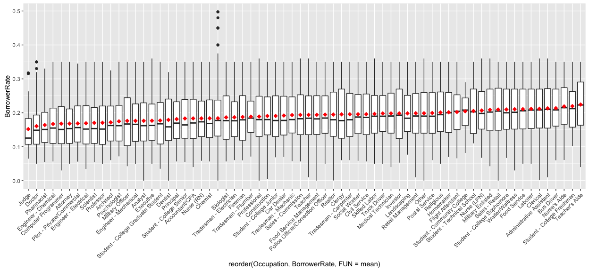

Here we see what we would expect to find -- that students and low-income occupations tend to receive higher interest rates, while liberal professionals, like doctors, judges, and other high income professions tend to receive lower interest rates.

Now let's turn to the lending institution's metric of creditworthiness, the Prosper Score.

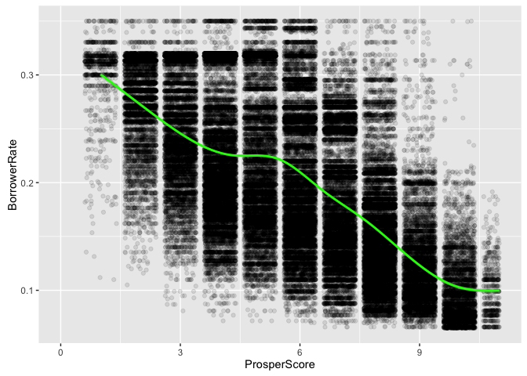

As expected, here we see a very strong negative relationship, with average borrower rate declining at a hefty pace as Prosper Score increases. We will want to explore this relationship further below by layering in other variables.

How, if at all, did Prosper Scores evolve over time since July 2009, when the lending institution started using this metric?

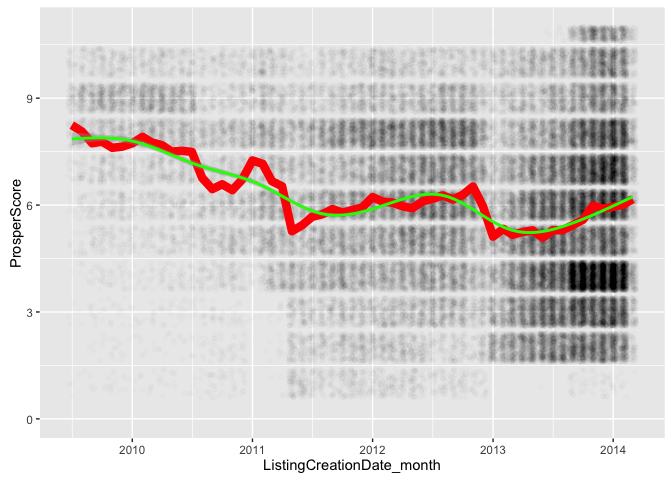

In the post-crisis period, during which Prosper Score has been used, we see a general decline in the average Prosper Score of borrowers, and the darkening of the plot as we move from left to right demonstrates the rising number of loans given out. In the early post-crisis period, we see the lending institution targeted only those borrowers with fairly high Prosper Scores, no doubt because it wanted to take on little risk in this shaky period. Over time, the lending institution became more confortable with riskier loans, accepting a rising number of borrowers with lower Prosper Scores.

Let's begin by looking at the relationship between our three major variables of interest: borrower rate, loan amount, and Prosper Score.

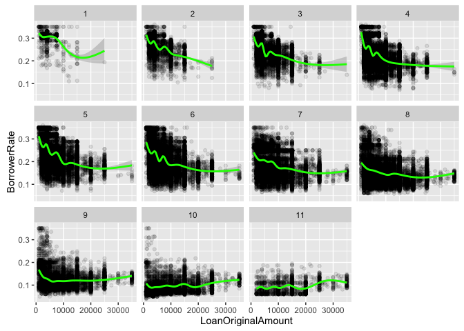

We see several interesting things here. 

First, borrowers with very low Prosper Scores receive only small loans, while those with higher scores receive loans across the spectrum of loan size. 

Second, for lower Prosper Scores, as loan size increases, borrower rate decreases at a fairly steep rate, yet for higher Prosper Scores the average borrower rate stays very low across all loan amounts. If anything, for those with very high Prosper Scores, we actually see a slightly higher average borrower rate for larger loans than for smaller loans. 

Third, in the middle range of Prosper Scores, we see significantly more heteroscadacity than we do at either the lower or upper range of Prosper Scores. More specifically, for the middle range, we see huge variation in borrower rate at the lower end of the loan amount range, suggesting that Prosper Score needs to be interacted with other variable(s) to explain variation in this range.

Let's turn to the relationship between loan amount and borrower income, broken out by Prosper Score.

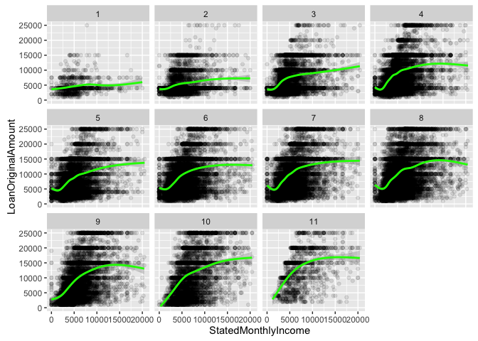

Here we see that the upward slope in average loan amount over the monthly income range grows more positive as Prosper Score rises. 

We now turn to the evolution in average Prosper Score over time, faceted by employment status.

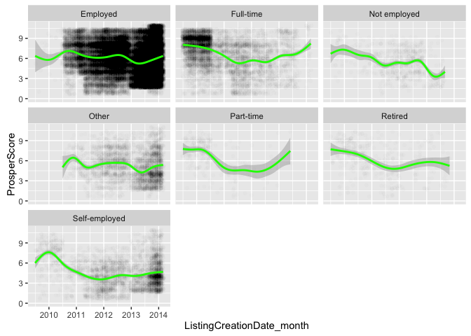

Several interesting insights come out of this view. First we can see that the value 'employed' only apparently came into use in late 2010, prior to which 'full-time' seems to have been used to convey the same thing. Second, we see that the lending institution seems to increasingly penalize being 'not employed' over time -- in 2013, average Prosper Scores for borrowers not employed is much lower than it was in 2009. The same is true for 'self-employed' though the decline in average Score occurs earlier and more rapidly than for 'not employed'. By contrast, though few borrowers appear to fall into this cateogry, being 'part-time' employed appears to have meant a penalty early on, but that penalty was reversed in more recent years. It isn't straightforward why average Prosper Scores have moved in the directions they have for these groups.

Let's examine borrower rate over time, broken out by Prosper Score.

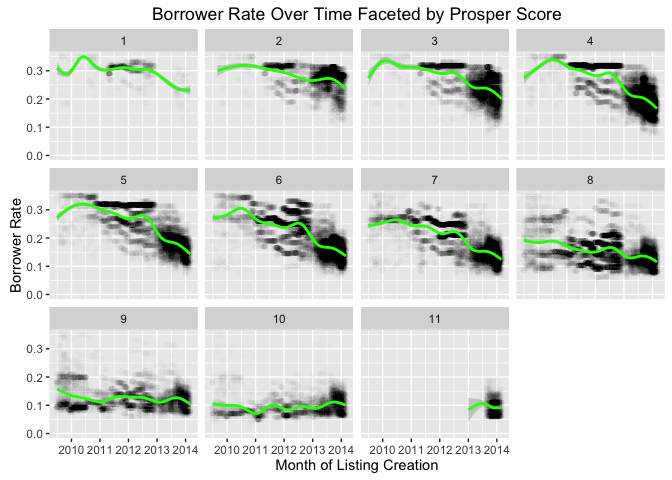

Several interesting findings here. First, average borrower rate has declined over time for most Prosper Score levels, though not at the very top scores, as these borrowers consistently received low interest rates on their loans. 

Second, the decline in average borrower rate is steepest for mid-range Prosper Score levels (4-7).

Third, we see a substantial rise in loans given once borrower rates come down substantially. We would need to investigate further to confirm this hypothesis, but looking at the plot here it appears that the dramatic rise in number of loans in 2013-2014 occurred principally among borrowers in the mid-range Prosper Score levels, where average interest rates had declined precipitously in the preceding period. In this sense, we see an 'easy money' period arise, and significant borrower demand respond to this climate by taking out loans.

Let's look at borrower rate by debt-to-income ratio, colored by homeownership status. This might prove interesting because homeownership is a special kind of debt in the eyes of lending institutions -- it is something banks can go after if a borrower defaults on a loan, whereas many other kinds of debt are unreachable by banks upon default.

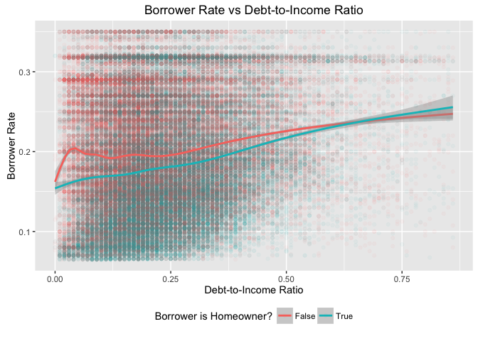

As expected, we see that, holding debt-to-income ration constant, borrower rate is higher for borrowers that are not homeowners than for those that are homeowners, except at extreme debt-to-income levels, though here we have so few data points that the trend lines are pretty meaningless anyways.

Finally, let's look at borrower rate by employment status duration, broken out by Prosper Score level.

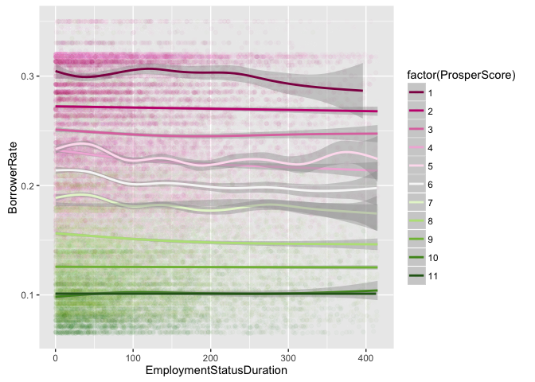

What this plot tells us is that employment status duration on its own is not very useful in explaining variation in borrower rate. For each Prosper Score level, average borrower rate stays more or less constant over the range of employment status duration.
