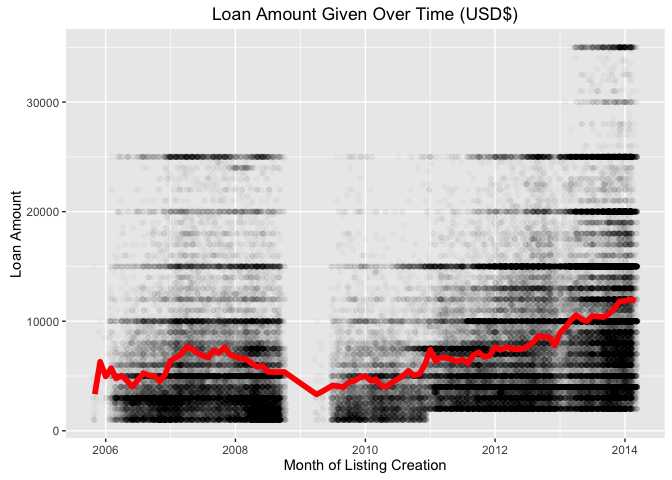

## Exploration of Prosper Loan Dataset
_updated 08 May 2016_

This project explores the Prosper loan dataset, which contains data on 113,937 loans across 81 variables, ranging from interest rate, to loan amount, to borrower's income and employment status, and so on. My exploration focuses in particular on the interest rate applied to the loan.

- To view my exploration of the dataset, including all visualizations, click [here](https://github.com/jasonstan/sandbox/blob/master/prosper_loan_exploration/prosper_loan_exploration.md).
- To view the underlying RMD file, containing all R chunks, click [here](https://github.com/jasonstan/sandbox/blob/master/prosper_loan_exploration/prosper_loan_exploration.rmd).

### Some visual highlights:

